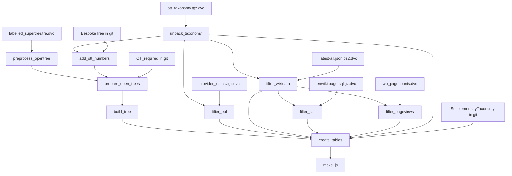

# DVC Pipeline for OneZoom Tree-Build

## Current State

The build process is a sequence of manual shell commands documented in `[oz_tree_build/README.markdown](oz_tree_build/README.markdown)`. Key pain points:

- Massive source files (Wikidata ~100GB, enwiki SQL ~1GB, pageviews multi-GB) must be downloaded by every contributor
- `generate_filtered_files` takes **5-7 hours** to reduce these to usable subsets
- Pre-processed pageviews are distributed as GitHub releases as a workaround (no longer needed with DVC)
- No caching or reproducibility guarantees

## Target Workflow

```bash
# First person: downloads data, runs pipeline, pushes cache
dvc repro
dvc push

# Everyone else: pulls only the cached outputs they need
dvc repro --pull --allow-missing
```

If nothing has changed, `dvc repro --pull --allow-missing` pulls pre-built outputs from shared storage -- no multi-GB downloads, no 5-7 hour filtering runs.

## Pipeline DAG

The monolithic `filter_files` stage is split into 4 independent filter stages. EOL and wikidata filters can run in parallel (both depend on taxonomy). SQL and pageview filters can run in parallel (both depend on filtered wikidata output).



## Key Design Decisions

### 1. Parameters in `params.yaml` (replaces env vars)

Currently `OT_VERSION`, `OT_TAXONOMY_VERSION`, `OT_TAXONOMY_EXTRA`, and `OZ_TREE` are shell environment variables. These become DVC parameters so that changing a version automatically invalidates the right stages.

```yaml
# params.yaml
oz_tree: AllLife
ot_version: "15.1"
ot_taxonomy_version: "3.7"
ot_taxonomy_extra: "draft2"
build_version: 28017344 # deterministic version for CSV_base_table_creator (replaces time-based default)
exclude_from_popularity:
  - Archosauria_ott335588
  - Dinosauria_ott90215
```

The `build_version` param is important: `CSV_base_table_creator` defaults to `int(time.time()/60)`, which would make outputs non-deterministic. A fixed param ensures DVC caching works correctly.

### 2. Source data tracked with `dvc add`

Large downloaded files are tracked via `dvc add`, producing `.dvc` files committed to git. The raw data itself lives only in DVC cache/remote, never in git. Files to track:

- `data/OpenTree/labelled_supertree_simplified_ottnames.tre`
- `data/OpenTree/ott${ot_taxonomy_version}.tgz`
- `data/Wiki/wd_JSON/latest-all.json.bz2`
- `data/Wiki/wp_SQL/enwiki-latest-page.sql.gz`
- `data/Wiki/wp_pagecounts/` (directory -- raw pageview files; pre-processed GitHub releases are no longer needed since DVC caches the filtered outputs)
- `data/EOL/provider_ids.csv.gz`

With `--allow-missing`, DVC can skip stages whose inputs haven't changed even when the raw files aren't present locally.

### 3. Split filters into separate modules and remove mtime caching

The monolithic `[generate_filtered_files.py](oz_tree_build/utilities/generate_filtered_files.py)` will be refactored:

**Remove `generate_and_cache_filtered_file`** -- this function implements mtime-based caching (comparing filtered file timestamps to source file timestamps). DVC's run cache completely supersedes this. Each filter script simply writes its output; DVC decides whether to run it.

**Split into 4 separate filter modules**, each with its own CLI entry point:

- `oz_tree_build/utilities/filter_eol.py` -- filters EOL provider IDs CSV
  - Inputs: EOL CSV (gz), taxonomy.tsv
  - Output: filtered EOL CSV
  - Reads taxonomy to build `source_ids` (NCBI, IF, WoRMS, IRMNG, GBIF sets), then keeps only matching EOL rows
- `oz_tree_build/utilities/filter_wikidata.py` -- filters the massive wikidata JSON dump (~100GB compressed)
  - Inputs: wikidata JSON (bz2), taxonomy.tsv
  - Outputs: filtered wikidata JSON, **plus a sidecar `wikidata_titles.txt`** (one Wikipedia page title per line)
  - The sidecar file replaces the in-memory `context.wikidata_ids` handoff. It's produced by running the equivalent of `read_wikidata_dump()` on the filtered output and writing the titles to a text file. This is the key that enables SQL and pageview filters to run independently.
- `oz_tree_build/utilities/filter_wikipedia_sql.py` -- filters enwiki SQL page dump
  - Inputs: enwiki SQL (gz), `wikidata_titles.txt`
  - Output: filtered SQL file
  - Reads the titles file to build the filter set (replaces `context.wikidata_ids`)
- `oz_tree_build/utilities/filter_pageviews.py` -- filters Wikipedia pageview files
  - Inputs: one or more pageview files (bz2), `wikidata_titles.txt`
  - Output: filtered pageview files in output directory
  - Reads the titles file to build the filter set

**Shared code** stays in `generate_filtered_files.py` (or a new common module): `read_taxonomy_file`, helper imports, and the orchestrating `generate_all_filtered_files` function (simplified to call the individual filter modules directly, useful for non-DVC usage and clade-specific test filtering).

**New console scripts** registered in `pyproject.toml`:

```
filter_eol = "oz_tree_build.utilities.filter_eol:main"
filter_wikidata = "oz_tree_build.utilities.filter_wikidata:main"
filter_wikipedia_sql = "oz_tree_build.utilities.filter_wikipedia_sql:main"
filter_pageviews = "oz_tree_build.utilities.filter_pageviews:main"
```

The parallelism benefit: `filter_eol` and `filter_wikidata` share no outputs, so DVC can run them concurrently. Once `filter_wikidata` finishes and produces `wikidata_titles.txt`, `filter_sql` and `filter_pageviews` can also run concurrently.

### 4. JS output stays in this repo

`make_js_treefiles` currently defaults to writing into `../OZtree/static/FinalOutputs/data/`. In the DVC pipeline, use `--outdir data/output_files/js/` to keep outputs within this repo for DVC tracking. Users copy to OZtree manually afterward.

### 5. DVC remote (shared cache)

A DVC remote must be configured for shared caching. This is a one-line config per backend:

```bash
dvc remote add -d myremote s3://my-bucket/dvc-cache    # S3
dvc remote add -d myremote gs://my-bucket/dvc-cache    # GCS
dvc remote add -d myremote ssh://server:/path/to/cache  # SSH
dvc remote add -d myremote /mnt/shared/dvc-cache        # local/NFS
```

The choice of backend can be made later; the pipeline design is independent of it.

## Pipeline Stages (`dvc.yaml`)

The `dvc.yaml` at the project root will define these stages (using DVC templating with `vars` from `params.yaml`):

**preprocess_opentree** -- perl to strip mrca labels and normalize underscores

- deps: `data/OpenTree/labelled_supertree_simplified_ottnames.tre`
- params: `ot_version`
- outs: `data/OpenTree/draftversion${ot_version}.tre`

**unpack_taxonomy** -- extract taxonomy.tsv from tarball

- deps: `data/OpenTree/ott${ot_taxonomy_version}.tgz`
- params: `ot_taxonomy_version`
- outs: `data/OpenTree/ott${ot_taxonomy_version}/` (directory)

**add_ott_numbers** -- call OpenTree API to annotate bespoke trees with OTT IDs

- deps: `data/OZTreeBuild/${oz_tree}/BespokeTree/include_noAutoOTT/`
- params: `oz_tree`, `ot_taxonomy_version`, `ot_taxonomy_extra`
- outs: `data/OZTreeBuild/${oz_tree}/BespokeTree/include_OTT${ot_taxonomy_version}${ot_taxonomy_extra}/`
- Note: calls external API; cached unless inputs change. Use `dvc repro -f add_ott_numbers` to force refresh.

**prepare_open_trees** -- copy supplementary .nwk files and extract OpenTree subtrees

- deps: `draftversion${ot_version}.tre`, `include_OTT.../`, `OT_required/`
- outs: `data/OZTreeBuild/${oz_tree}/OpenTreeParts/OpenTree_all/`

**build_tree** -- assemble the full newick tree

- deps: `include_OTT.../`, `OpenTree_all/`
- outs: `data/OZTreeBuild/${oz_tree}/${oz_tree}_full_tree.phy`

**filter_eol** -- filter EOL provider IDs to relevant sources

- deps: `data/EOL/provider_ids.csv.gz`, `data/OpenTree/ott${ot_taxonomy_version}/taxonomy.tsv`
- outs: `data/filtered/OneZoom_provider_ids.csv`
- Parallelizable with `filter_wikidata`

**filter_wikidata** -- filter massive wikidata JSON to taxon/vernacular items (THE most expensive step, hours)

- deps: `data/Wiki/wd_JSON/latest-all.json.bz2`, `data/OpenTree/ott${ot_taxonomy_version}/taxonomy.tsv`
- outs: `data/filtered/OneZoom_latest-all.json`, `data/filtered/wikidata_titles.txt`
- Parallelizable with `filter_eol`

**filter_sql** -- filter enwiki SQL page dump to matching titles

- deps: `data/Wiki/wp_SQL/enwiki-latest-page.sql.gz`, `data/filtered/wikidata_titles.txt`
- outs: `data/filtered/OneZoom_enwiki-latest-page.sql`
- Parallelizable with `filter_pageviews`

**filter_pageviews** -- filter and aggregate Wikipedia pageview counts

- deps: `data/Wiki/wp_pagecounts/`, `data/filtered/wikidata_titles.txt`
- outs: `data/filtered/pageviews/` (directory of filtered pageview files)
- Parallelizable with `filter_sql`

**create_tables** -- map taxa, calculate popularity, produce DB-ready CSVs and ordered trees

- deps: full tree, taxonomy, all `data/filtered/` outputs, `SupplementaryTaxonomy.tsv`
- params: `build_version`, `exclude_from_popularity`
- outs: `data/output_files/`

**make_js** -- convert ordered trees to JS viewer files

- deps: `data/output_files/`
- outs: `data/output_files/js/`

## Files to Create/Modify

- **Create** `params.yaml` -- pipeline parameters
- **Create** `dvc.yaml` -- pipeline definition (11 stages)
- **Create** `oz_tree_build/utilities/filter_eol.py` -- standalone EOL filter with CLI
- **Create** `oz_tree_build/utilities/filter_wikidata.py` -- standalone wikidata filter with CLI
- **Create** `oz_tree_build/utilities/filter_wikipedia_sql.py` -- standalone SQL filter with CLI
- **Create** `oz_tree_build/utilities/filter_pageviews.py` -- standalone pageviews filter with CLI
- **Modify** `[oz_tree_build/utilities/generate_filtered_files.py](oz_tree_build/utilities/generate_filtered_files.py)` -- remove `generate_and_cache_filtered_file`, simplify to orchestrator that calls the new modules (retains clade-filtering support for tests)
- **Modify** `[pyproject.toml](pyproject.toml)` -- add `dvc` to dependencies, register 4 new console scripts
- **Modify** `[.gitignore](.gitignore)` -- add `/data/filtered/`, DVC internals are handled by `dvc init`
- **Update** `[README.markdown](README.markdown)` -- new DVC-based workflow instructions
- **Update** `[oz_tree_build/README.markdown](oz_tree_build/README.markdown)` -- reference DVC pipeline
- **Update** `[data/Wiki/README.markdown](data/Wiki/README.markdown)` -- remove pre-processed pageview GitHub release instructions (DVC cache replaces this entirely)

After creating these files, the first pipeline run involves:

```bash
pip install -e .
dvc init
# download source files, then:
dvc add data/OpenTree/labelled_supertree_simplified_ottnames.tre
dvc add data/OpenTree/ott3.7.tgz
dvc add data/Wiki/wd_JSON/latest-all.json.bz2
dvc add data/Wiki/wp_SQL/enwiki-latest-page.sql.gz
dvc add data/Wiki/wp_pagecounts/
dvc add data/EOL/provider_ids.csv.gz
dvc repro
dvc push
git add . && git commit -m "Add DVC pipeline"
```

But this should not be run as part of this plan, the user will run it manually after the pipeline is set up.

Also note that you should not try to run the individual large stages as part of this plan, since the input files are massive and the processing takes a long time, so the user will schedule it for a convenient time.
